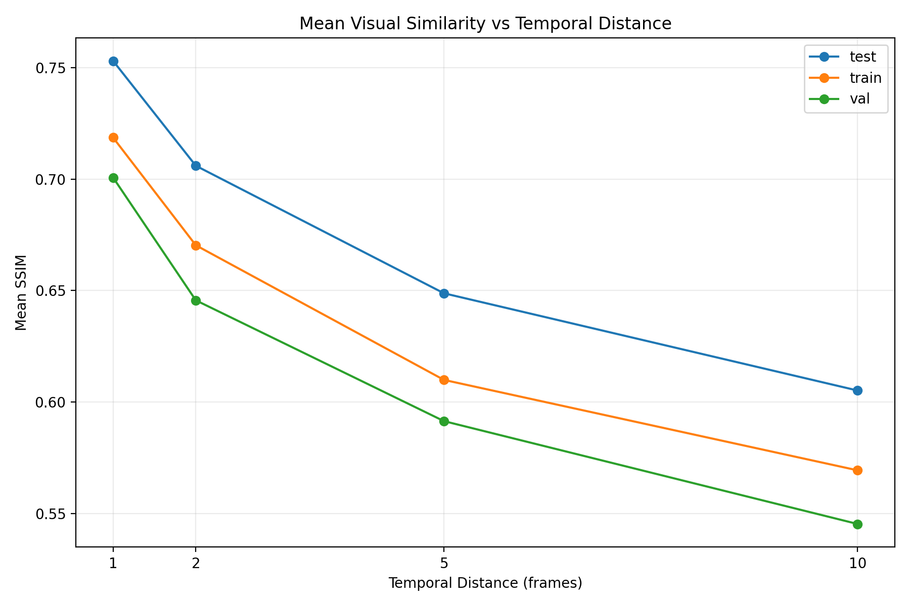
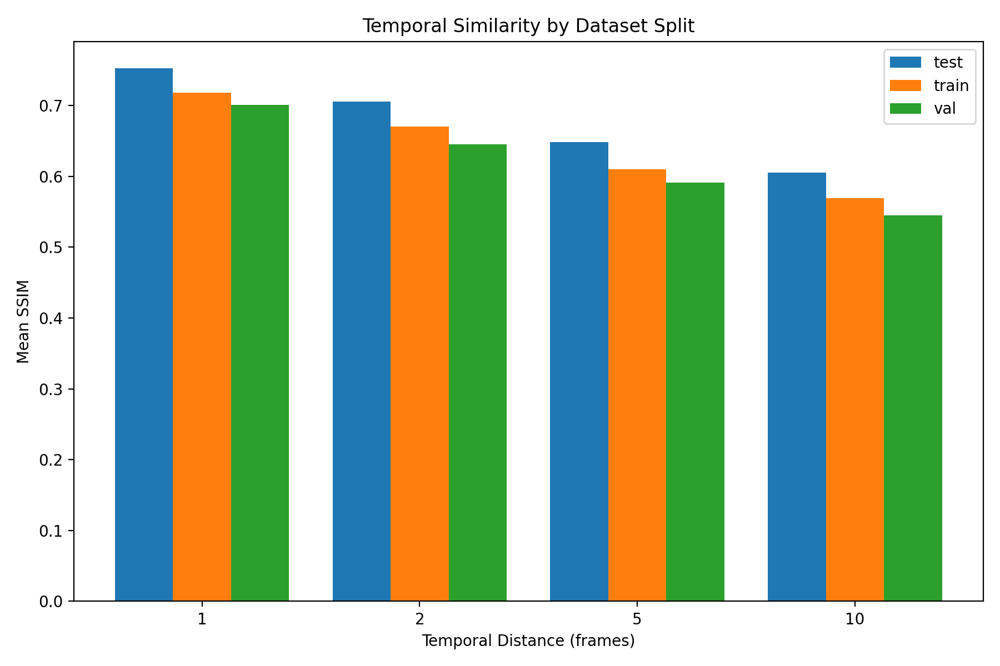
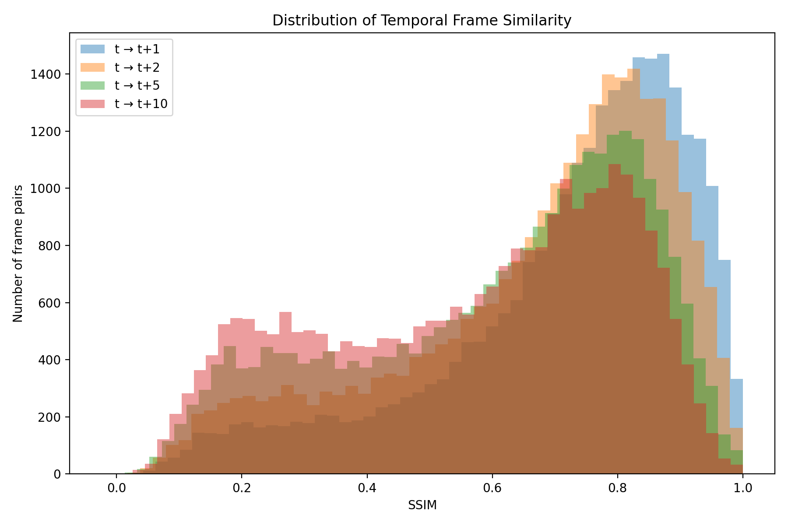
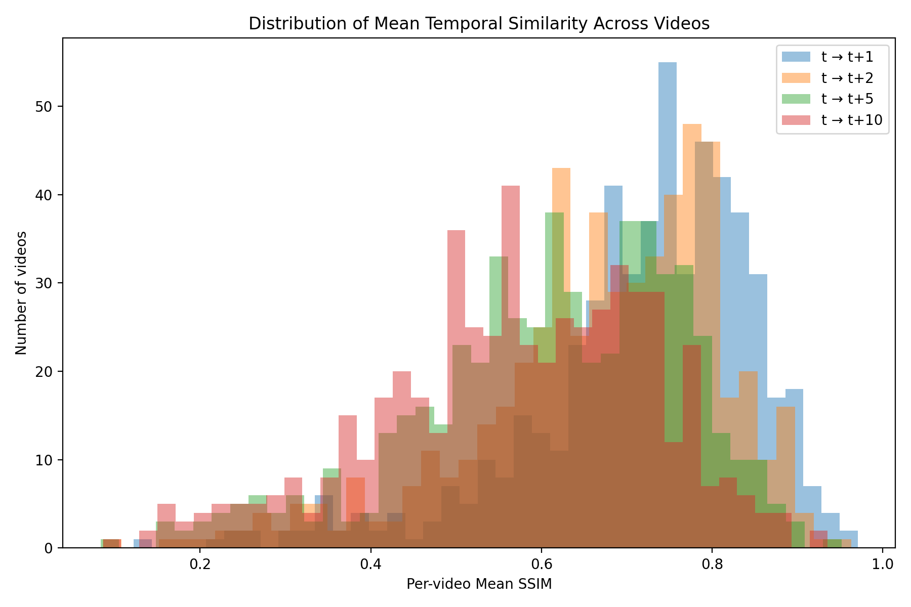

# Frame Similarity — Figures

This directory contains the visualizations generated by the
`02_frame_similarity.py` analysis.

The purpose of this analysis is to quantify how visually similar human-video
frames remain across different temporal distances.

Rather than assuming that consecutive video frames contain redundant
information, this analysis measures the redundancy directly using image-level
similarity metrics.

---

## Analysis Overview

The analysis evaluates pairs of frames separated by:

- Δt = 1
- Δt = 2
- Δt = 5
- Δt = 10

For each pair, several image-level metrics are computed:

- **SSIM** — Structural Similarity Index
- **MAE** — Mean Absolute Error
- **PSNR** — Peak Signal-to-Noise Ratio

The current experiment uses:

- **500,507 frames**
- **547 videos**
- **6 dataset shards**
- **Per-video sampling**
- **Maximum 50 frame pairs per video for each temporal distance**
- **224 × 224 image resolution for similarity computation**

The analysis produced **109,389 successful frame-pair comparisons** with no failed comparisons.

---

# Figures

## 1. Similarity by Temporal Distance



### `similarity_by_temporal_distance.png`

This figure shows how visual similarity changes as the temporal distance between
two frames increases.

The temporal distances evaluated are:

**1 → 2 → 5 → 10 frames**

The main trend is a gradual decrease in similarity as the temporal distance
increases.

This is important because it demonstrates that temporal redundancy is not
constant: frames that are close in time tend to contain more shared visual
information, while frames farther apart become increasingly different.

### Research relevance

This provides an initial empirical basis for asking:

> How much useful visual information can be transferred between temporally
> separated frames?

This question motivates the later correspondence and reconstruction stages.

---

## 2. Similarity by Dataset Split



### `similarity_by_split.png`

This figure compares frame similarity across the:

- Training set
- Validation set
- Test set

The purpose is to determine whether the temporal similarity structure is
consistent across the different dataset splits.

A consistent pattern across splits is desirable because it indicates that the
observed temporal behavior is not limited to a particular subset of the
dataset.

The split-level comparison is therefore also useful for evaluating whether
the temporal redundancy observed during analysis is likely to generalize.

---

## 3. SSIM Distribution



### `similarity_distribution_ssim.png`

This figure shows the distribution of SSIM values across the sampled frame
pairs.

Unlike a mean value alone, the distribution reveals the variability of temporal
similarity.

For example, a dataset may have a relatively high average SSIM while still
containing a substantial number of frame pairs with low similarity.

This distribution is therefore useful for understanding the diversity of
temporal relationships present in the videos.

### Why SSIM?

SSIM measures structural similarity between images and is particularly useful
for this analysis because the goal is not simply to measure pixel-level
difference, but to determine how much structural visual information is shared
between frames.

---

## 4. Distribution of Video-Level Mean SSIM



### `video_mean_ssim_distribution.png`

This figure summarizes the mean SSIM at the video level.

Each video contributes its own average temporal similarity, allowing us to
observe how temporal redundancy varies across different videos rather than
treating the entire dataset as a single population.

This distinction is important because human videos can exhibit substantially
different motion characteristics.

Some videos may contain:

- relatively static poses,
- slow movements,
- camera motion,
- rapid body movement,
- significant viewpoint changes,
- or changes in scene composition.

Consequently, temporal redundancy may vary significantly from video to video.

---

# Key Interpretation

The results should **not** be interpreted as evidence that temporally adjacent
frames are directly interchangeable.

Instead, they establish a more fundamental observation:

> Human videos contain measurable temporal visual redundancy, but the amount of
> shared information decreases as temporal distance increases.

This distinction is important for the next stages of the project.

High raw similarity does not necessarily imply that information from one frame
can be directly transferred to another frame.

The frames may contain corresponding information that is spatially displaced
because of:

- human motion,
- pose changes,
- camera motion,
- viewpoint changes,
- deformation,
- occlusion,
- and appearance changes.

Therefore, the next research question is not simply:

> "Are the frames similar?"

but rather:

> "Can useful visual information be reliably established across frames despite
> motion and spatial misalignment?"

This motivates the subsequent temporal-difference, motion-analysis, and
cross-frame correspondence experiments.

---

# Important Limitation

This analysis measures **raw image-level similarity**.

It does **not** perform:

- motion compensation,
- optical-flow alignment,
- feature correspondence,
- geometric matching,
- human-pose alignment,
- temporal fusion,
- or reconstruction.

Therefore, high SSIM should not be interpreted as proof that two frames are
useful reconstruction pairs.

The purpose of this stage is to establish the temporal structure of the dataset
before introducing more sophisticated correspondence mechanisms.

---

# Reproducibility

The figures in this directory were generated by:

`02_temporal_redundancy/02_frame_similarity.py`

The analysis uses the master dataset index generated during the dataset
integrity stage:

`01_dataset_audit/results/integrity/master_index.csv`

The raw dataset itself is not stored in this repository.

The complete numerical results are available in:

`../similarity/`

including:

- `similarity_summary.csv`
- `video_similarity_statistics.csv`
- `similarity_errors.csv`
- `similarity_summary.json`

---

# Figure Summary

| Figure | Purpose |
|---|---|
| `similarity_by_temporal_distance.png` | How similarity changes with temporal distance |
| `similarity_by_split.png` | Comparison of temporal similarity across dataset splits |
| `similarity_distribution_ssim.png` | Distribution of frame-level SSIM |
| `video_mean_ssim_distribution.png` | Distribution of video-level mean SSIM |

---

## Position in the Research Pipeline

```text
01 Dataset Audit
       ↓
02 Temporal Structure
       ↓
02 Frame Similarity  ← This analysis
       ↓
03 Temporal Difference
       ↓
04 Motion Analysis
       ↓
05 Temporal Correspondence
       ↓
Human Video Reconstruction