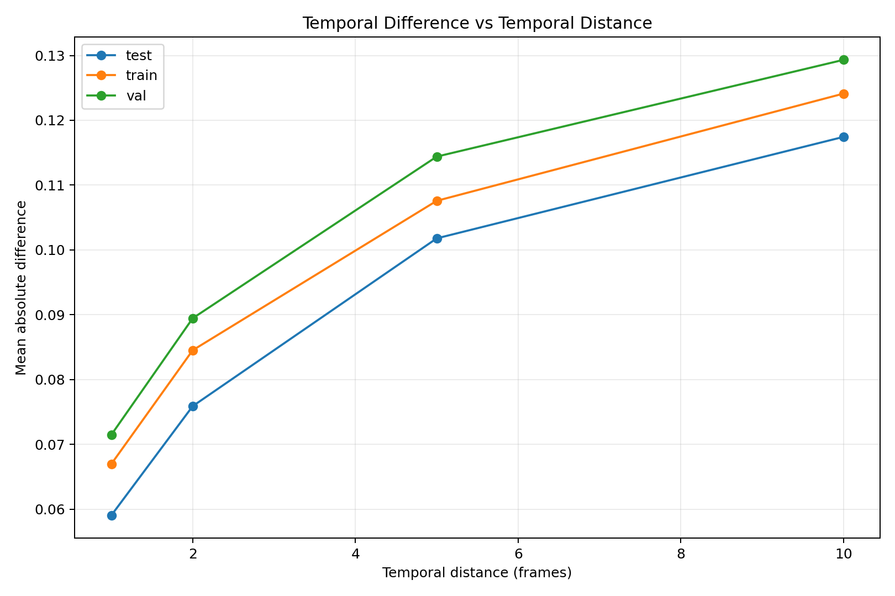
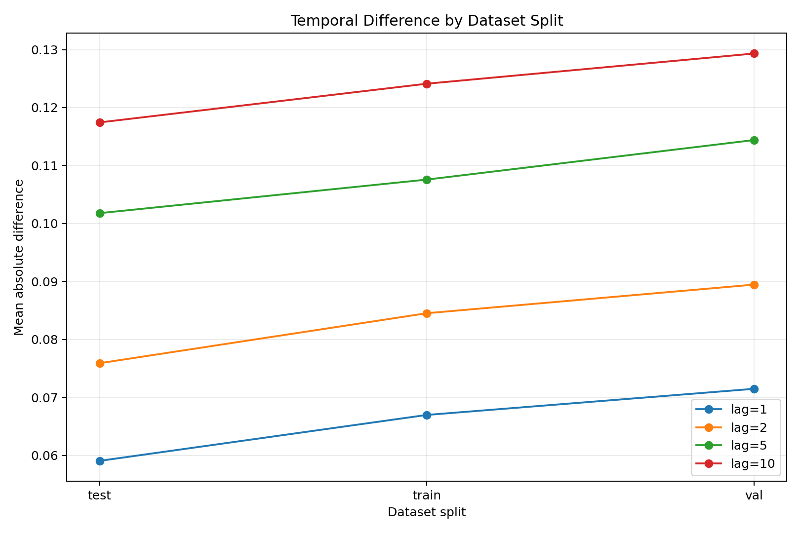
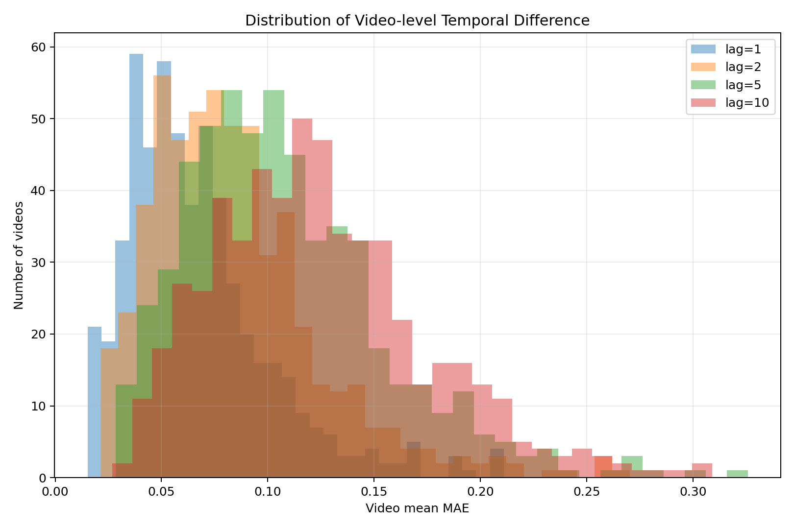
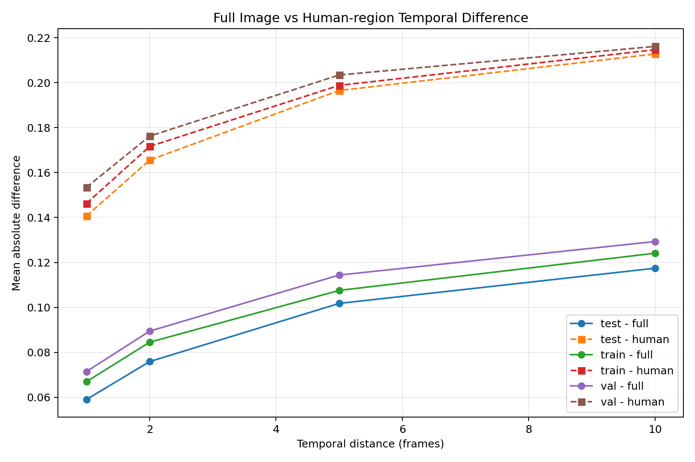

# Temporal Difference Analysis — Figures

This directory contains the visual results generated by `03_temporal_difference.py`.

The figures summarize how visual differences between temporally separated video frames change across temporal distances and dataset splits, with particular attention to human-related regions.

---

## Overview

The temporal difference analysis evaluates frame-to-frame visual changes at four temporal distances:

- **Lag 1** — consecutive frames
- **Lag 2** — two-frame temporal separation
- **Lag 5** — five-frame temporal separation
- **Lag 10** — ten-frame temporal separation

The analysis was performed across the complete dataset:

| Property | Value |
|---|---:|
| Total frames | 500,507 |
| Videos | 547 |
| Dataset shards | 6 |
| Temporal distances | 1, 2, 5, 10 |
| Sampling strategy | Per-video |
| Successful comparisons | 110,291 |
| Failed comparisons | 0 |

The figures are intended to provide a visual interpretation of the numerical results stored in the corresponding `temporal_difference/` directory.

---

# Figures

## 1. Difference by Temporal Distance

### What this figure shows

This figure illustrates how temporal difference changes as the distance between two frames increases.

The temporal distances analyzed are:

- 1 frame
- 2 frames
- 5 frames
- 10 frames

### Main observation

Temporal difference increases systematically with temporal distance.

This indicates that frames that are close together in time tend to be more visually similar, while frames separated by larger temporal intervals exhibit greater visual change.

This behavior is consistent across the evaluated human-related regions and the full-frame measurements.

### Research relevance

This result provides evidence that the dataset contains meaningful temporal variation rather than simply repeating visually identical frames.

It also motivates investigating whether information from nearby frames can be exploited for reconstruction.

---

## 2. Difference by Dataset Split

### What this figure shows

This figure compares temporal difference statistics across the three dataset splits:

- Train
- Validation
- Test

The comparison helps determine whether the temporal behavior is approximately consistent across the dataset partitions.

### Main observation

The three splits exhibit similar temporal trends.

Although the absolute values differ slightly between splits, all splits show increasing temporal difference as the temporal distance increases.

For example, at temporal distance 10, the mean full-frame MAE is approximately:

| Split | Mean Full MAE |
|---|---:|
| Test | 0.1174 |
| Train | 0.1241 |
| Validation | 0.1293 |

These differences are relatively small compared with the overall temporal trend.

### Research relevance

The consistency of the temporal trend across train, validation, and test splits suggests that the observed temporal behavior is not limited to a single partition.

This is important for later experiments because a temporal reconstruction method should ideally generalize across the dataset splits.

---

## 3. Difference Distribution

### What this figure shows

This figure presents the distribution of temporal difference measurements across the analyzed frame pairs.

Unlike a mean value, a distribution shows how frequently different levels of temporal change occur.

This allows us to observe:

- concentration of low-difference frame pairs
- spread of temporal changes
- variability between frame pairs
- presence of higher-difference temporal transitions

### Main observation

The dataset contains a range of temporal changes rather than a single uniform level of difference.

Many temporally close frame pairs exhibit relatively small differences, while larger temporal separations produce broader and higher difference distributions.

### Research relevance

This variability is important because a reconstruction method cannot assume that every pair of nearby frames provides the same amount of useful information.

Some frame pairs may contain highly redundant information, while others may contain substantially different human configurations.

---

## 4. Full Image vs Human Region Difference

### What this figure shows

This figure compares temporal differences measured over the full image with differences measured specifically within human-related regions.

The analysis includes measurements associated with:

- Full image
- Human region
- Clothing region
- Skin region

### Main observation

Human-related regions exhibit substantially different temporal behavior from the full image.

For example, in the training split:

| Temporal Distance | Full MAE | Human MAE | Cloth MAE | Skin MAE |
|---:|---:|---:|---:|---:|
| 1 | 0.0670 | 0.1463 | 0.1393 | 0.1706 |
| 2 | 0.0845 | 0.1716 | 0.1642 | 0.1959 |
| 5 | 0.1076 | 0.1988 | 0.1918 | 0.2198 |
| 10 | 0.1241 | 0.2146 | 0.2091 | 0.2311 |

The human-related measurements increase as temporal distance increases.

Skin regions show particularly high temporal differences in the analyzed measurements.

### Important interpretation

The difference between full-image and human-region measurements should not be interpreted simply as a direct ranking of motion magnitude.

The measurements are calculated over different pixel populations and therefore describe different aspects of temporal variation.

Consequently, these results should be interpreted as evidence of different temporal visual behavior rather than as a direct physical measurement of human motion.

---

# Overall Visual Interpretation

Taken together, the four figures show a consistent temporal pattern:

**Short temporal distances → lower visual difference**

**Longer temporal distances → higher visual difference**

At the same time, human-related regions exhibit temporal behavior that differs from the full image.

This provides an important observation for the next stages of the research pipeline:

**Temporal redundancy exists, but it is not uniform across time or across image regions.**

The information contained in neighboring frames therefore has the potential to be useful for reconstruction, but its usefulness may depend on:

- temporal distance
- human motion
- clothing deformation
- body configuration
- occlusion
- correspondence quality

These questions are investigated in subsequent temporal analyses.

---

# Connection to the Temporal Redundancy Pipeline

This figure set is part of the second stage of the project:

`02_temporal_redundancy`

The current analysis follows:

`01_temporal_structure.py`

which established that the video sequences are temporally continuous.

It is followed by:

`02_frame_similarity.py`

which measures visual similarity between temporally separated frames.

The current analysis:

`03_temporal_difference.py`

measures the magnitude of visual change between those frames.

The next stages investigate whether these visual changes can be explained and exploited through motion and temporal correspondence.

---

# Interpretation Boundary

These figures demonstrate **temporal visual variation**.

They do not by themselves demonstrate:

- accurate motion estimation
- reliable frame correspondence
- reconstruction improvement
- super-resolution performance
- causal relationships between motion and reconstruction quality

Those questions require additional analysis and controlled experiments.

Therefore, the results presented here should be considered **dataset-level temporal observations**, not final reconstruction conclusions.

---

# Generated By

Analysis script:

`02_temporal_redundancy/03_temporal_difference.py`

Output directory:

`02_temporal_redundancy/results/03_temporal_difference/figures/`

Numerical results are available in:

`02_temporal_redundancy/results/03_temporal_difference/temporal_difference/`

---

# Figure Summary

| Figure | Purpose |
|---|---|
| `difference_by_temporal_distance.png` | Shows how temporal difference changes with frame separation |
| `difference_by_split.png` | Compares temporal difference across train, validation, and test |
| `difference_distribution.png` | Shows the distribution and variability of temporal differences |
| `full_vs_human_difference.png` | Compares full-image and human-related temporal differences |

---

## Key Observation

The central observation from this analysis is:

**Temporal differences increase with temporal distance, while human-related regions exhibit distinct and stronger temporal variation than the full image.**

This observation motivates the next stage of the pipeline: **motion analysis and temporal correspondence**.