# Motion Analysis — Figures

This directory contains the visual results generated by:

`02_temporal_redundancy/04_motion_analysis.py`

The figures provide a visual summary of the temporal motion characteristics of the PhySense-Human dataset across different temporal distances and dataset splits.

The purpose of this analysis is to determine how human motion changes over time and whether temporal information between frames remains sufficiently stable and informative for subsequent temporal correspondence and human video reconstruction.

---

## What This Analysis Measures

The motion analysis investigates temporal changes between frames at several temporal distances:

- Lag 1 — immediately adjacent frames
- Lag 2 — frames separated by two positions
- Lag 5 — frames separated by five positions
- Lag 10 — frames separated by ten positions

The analysis is performed across:

- Train
- Validation
- Test

The results help answer an important question:

> How does human motion evolve as the temporal distance between frames increases?

This is particularly important because high temporal redundancy does not necessarily imply reliable temporal correspondence.

---

# Figures

## 1. Motion by Temporal Distance

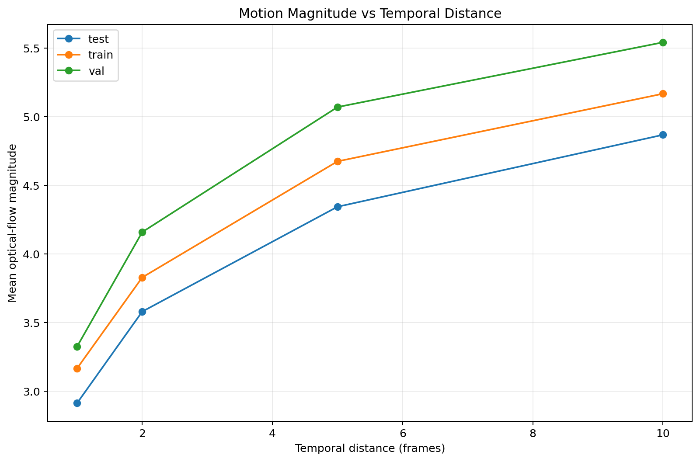

### What it shows

This figure summarizes the measured motion as a function of temporal distance.

The x-axis represents the temporal lag between frames, while the y-axis represents the measured motion magnitude.

The figure allows us to observe whether motion increases systematically as frames become farther apart.

### Interpretation

If motion increases with temporal distance, this indicates that frames that are close in time are more likely to contain compatible visual information, while frames farther apart may require stronger alignment or correspondence estimation.

This provides an important motivation for investigating motion-aware temporal correspondence rather than simply aggregating arbitrary neighboring frames.

---

## 2. Motion Coverage by Temporal Distance

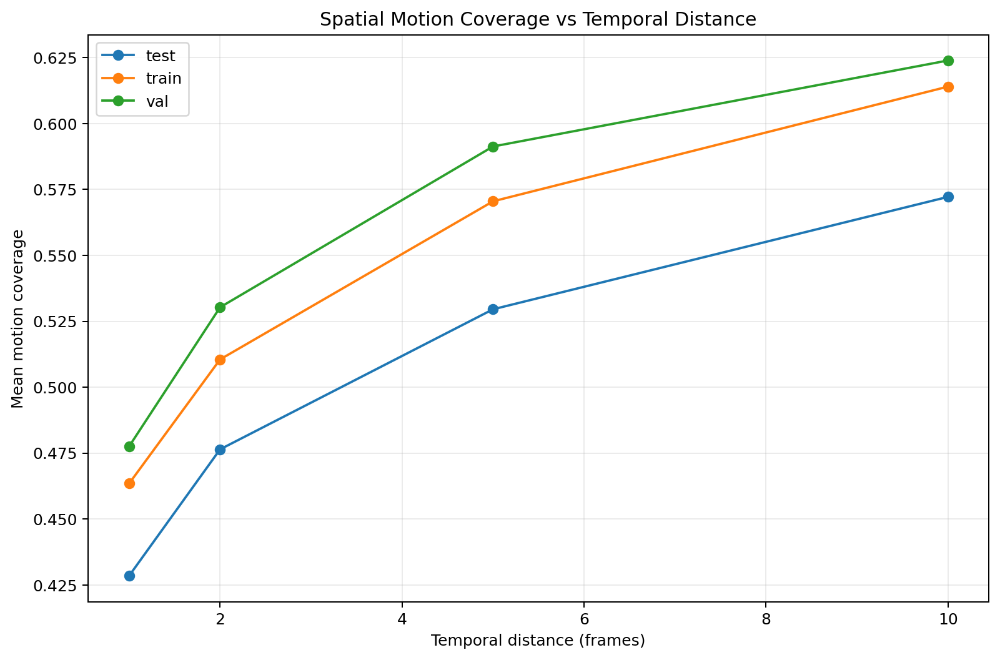

### What it shows

This figure shows how much of the image content is affected by measurable temporal motion at different temporal distances.

Unlike a single motion magnitude value, motion coverage provides information about the spatial extent of the change.

### Why it matters

Two pairs of frames may have similar average motion magnitude but very different spatial behavior.

For example:

- motion concentrated around the hands,
- motion concentrated around the legs,
- motion across the entire body,
- or motion affecting both the person and the surrounding scene.

Therefore, motion coverage provides additional information about the structure of temporal changes.

### Research relevance

This measurement is particularly useful for human video reconstruction because not all regions of the human body move equally.

A reconstruction system may therefore benefit from treating temporal information differently depending on where motion occurs.

---

# Motion by Dataset Split

The following figures compare motion characteristics between the training, validation, and test subsets.

These comparisons are important because the temporal behavior of the three splits should be understood before using temporal information in later experiments.

---

## 3. Motion by Split — Lag 1

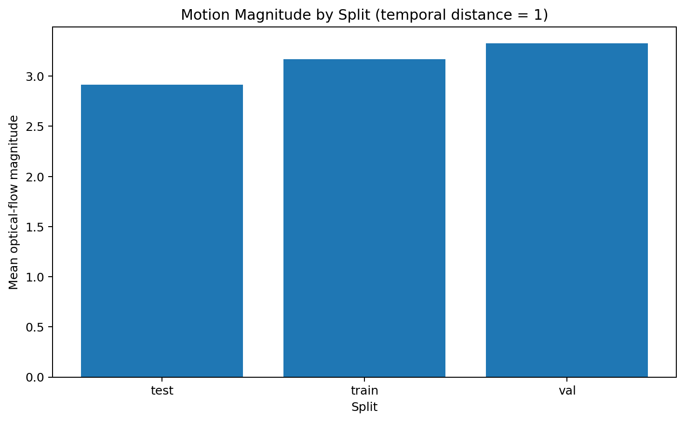

### What it shows

This figure compares motion between immediately adjacent frames across:

- Train
- Validation
- Test

Lag 1 represents the smallest temporal separation analyzed in this stage.

### Interpretation

Adjacent frames are expected to have relatively strong temporal continuity.

The distribution observed here provides a baseline for understanding the amount of motion present during the shortest temporal interval.

This measurement is especially important because adjacent frames are the most natural candidates for temporal correspondence.

---

## 4. Motion by Split — Lag 2

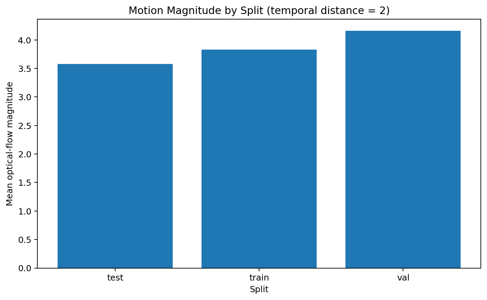

### What it shows

This figure presents the motion statistics for frames separated by two temporal positions.

Compared with Lag 1, the temporal separation is larger and therefore provides an initial indication of how quickly temporal consistency changes.

### Interpretation

An increase in motion from Lag 1 to Lag 2 would indicate that even a small increase in temporal distance introduces measurable visual changes.

This helps characterize the temporal scale at which neighboring frames remain useful.

---

## 5. Motion by Split — Lag 5

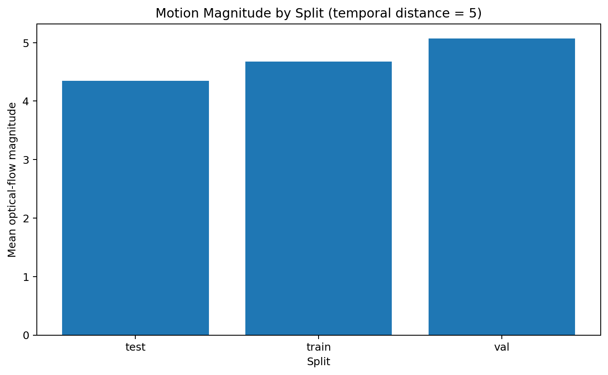

### What it shows

This figure measures motion for frames separated by five positions.

At this temporal distance, the frames may contain substantially different human poses or appearances compared with immediately adjacent frames.

### Research relevance

Lag 5 is useful for testing whether information farther away in time can still provide meaningful information for reconstruction.

If correspondence quality decreases at this distance, a reconstruction system may need explicit motion compensation or reliability estimation.

---

## 6. Motion by Split — Lag 10

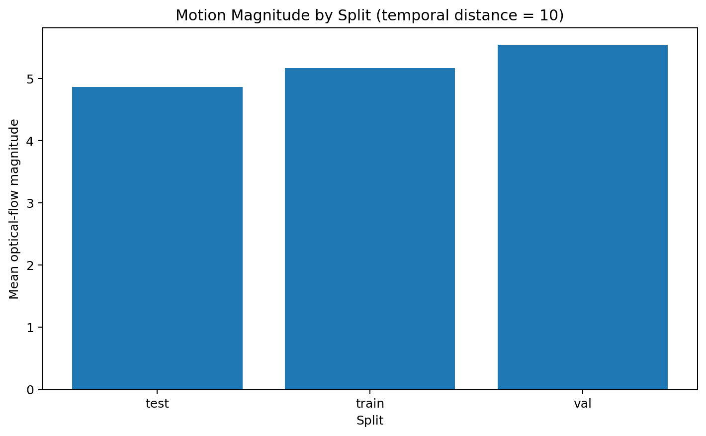

### What it shows

This figure presents motion statistics for frames separated by ten positions.

This represents the largest temporal distance evaluated in this analysis.

### Interpretation

Large temporal distances can introduce significant changes in:

- body pose,
- limb position,
- clothing configuration,
- visible body regions,
- and overall appearance.

Therefore, frames at this distance should not automatically be treated as equivalent information sources.

This motivates the investigation of temporal correspondence reliability in the next stages of the pipeline.

---

# Motion Distributions

The following figures show the distribution of motion measurements for each temporal lag.

---

## 7. Motion Distribution — Lag 1

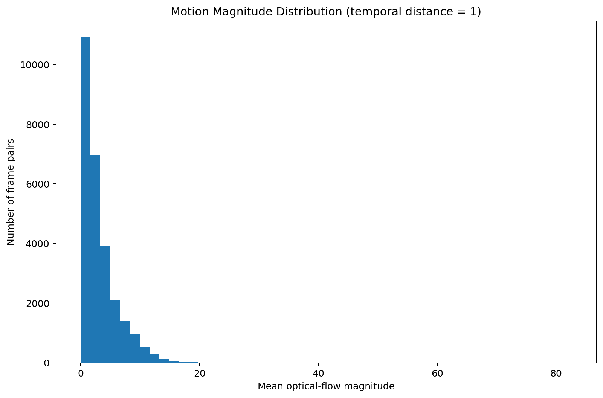

### What it shows

This distribution describes the range and frequency of motion values between immediately adjacent frames.

Lag 1 provides the reference distribution for the shortest temporal interval.

### Interpretation

A concentrated distribution would indicate relatively stable frame-to-frame motion, while a wider distribution would indicate greater variation in motion dynamics across videos.

---

## 8. Motion Distribution — Lag 2

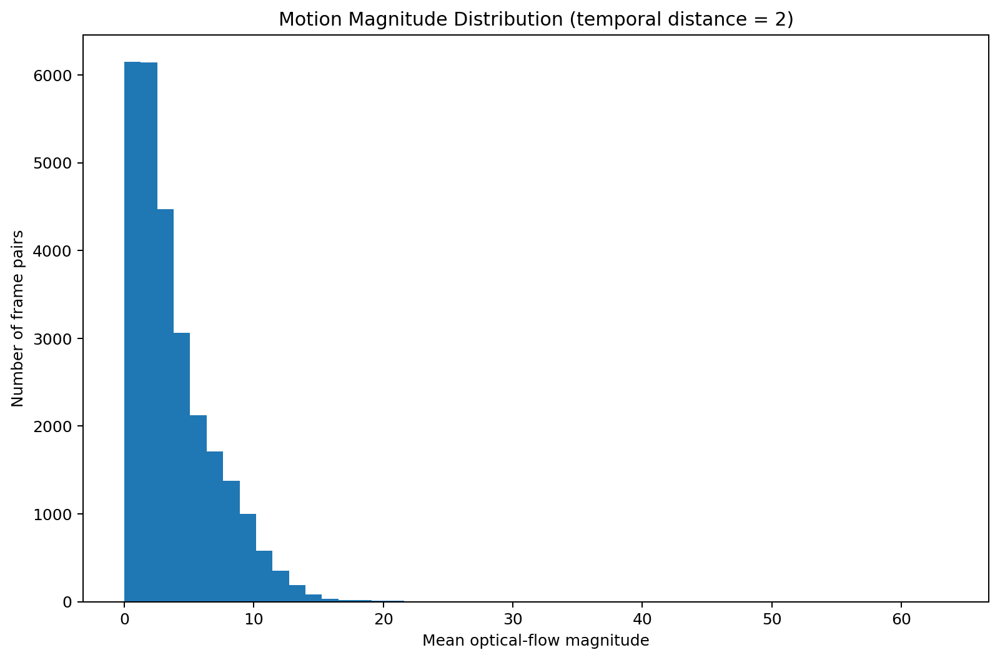

### What it shows

This figure shows how motion values are distributed for frames separated by two positions.

Compared with Lag 1, it helps quantify how the motion distribution changes when temporal separation increases.

### Research relevance

This provides evidence about the temporal stability of visual information and helps identify whether a fixed temporal neighborhood is appropriate for future reconstruction models.

---

## 9. Motion Distribution — Lag 5

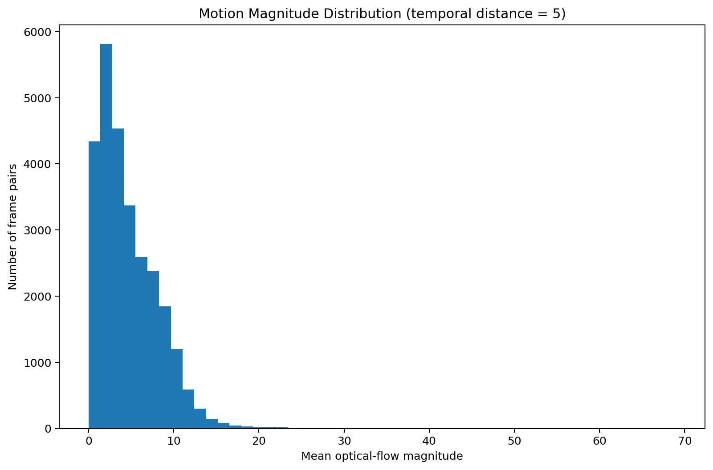

### What it shows

This figure presents the motion distribution at temporal distance five.

At this distance, the range of observed motion can become broader because more substantial pose changes may occur between the two frames.

### Interpretation

A broader distribution suggests that temporal correspondence becomes increasingly dependent on the actual motion state of the subject.

This is an important observation for motion-aware correspondence methods.

---

## 10. Motion Distribution — Lag 10

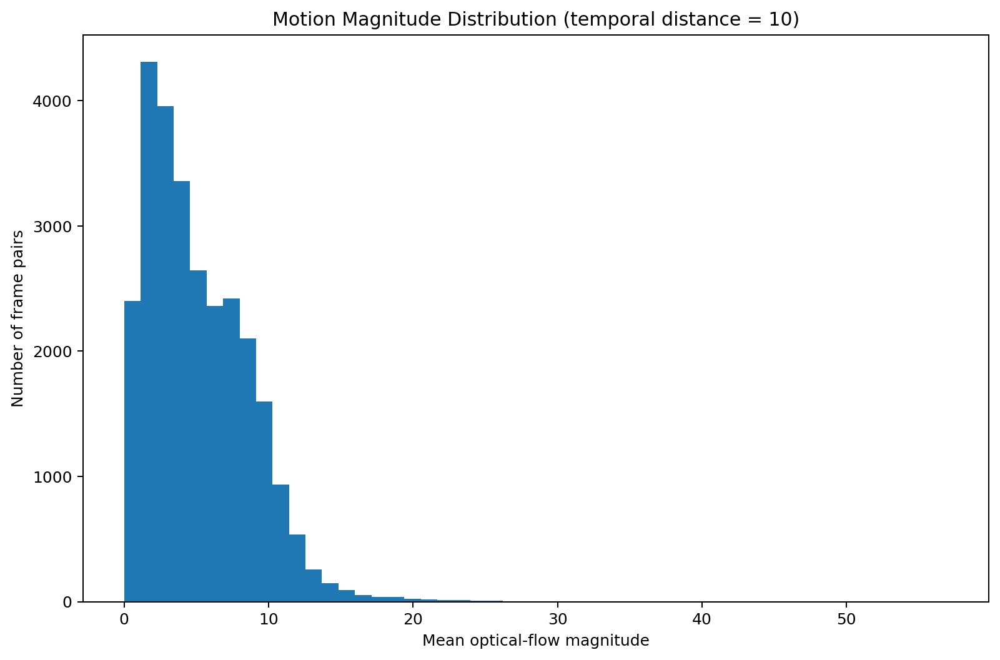

### What it shows

This figure shows the distribution of motion values at the largest temporal distance evaluated in this stage.

### Interpretation

The Lag 10 distribution provides an upper reference point for temporal change within the current analysis.

Large motion values at this distance indicate that temporal information becomes increasingly different as frames become farther apart.

Therefore, temporal distance alone may not be sufficient for deciding whether a frame is useful for reconstruction.

---

# Video-Level Motion Variation

## 11. Video Motion Distribution

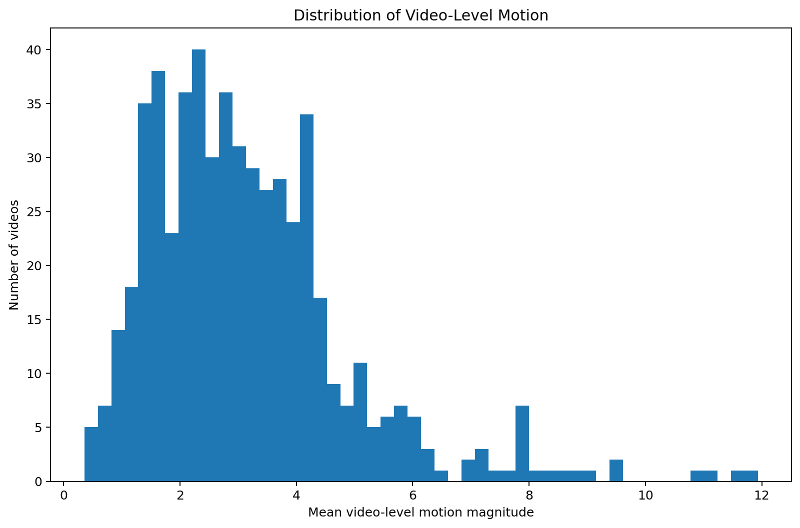

### What it shows

This figure summarizes motion behavior at the video level.

Each video can exhibit a different motion profile depending on:

- subject movement,
- action type,
- pose changes,
- camera behavior,
- clothing motion,
- and temporal dynamics.

### Why this matters

The dataset should not be treated as if every video contains identical motion characteristics.

Some videos may contain:

- mostly static human poses,
- slow movement,
- moderate movement,
- rapid movement,
- or substantial pose changes.

This variation is important when designing and evaluating temporal reconstruction methods.

---

# Overall Interpretation

Together, these figures provide a visual description of the temporal motion structure of the PhySense-Human dataset.

The analysis investigates four increasingly distant temporal relationships:

`Lag 1 → Lag 2 → Lag 5 → Lag 10`

This allows us to study how motion evolves as temporal distance increases.

A key conceptual distinction is:

`Temporal similarity ≠ Temporal correspondence`

Two frames may be visually similar while still containing different spatial configurations of the human body.

Conversely, two frames with significant pixel-level differences may still contain useful corresponding information after appropriate motion compensation.

Therefore, motion analysis is not itself the final reconstruction method.

Instead, it provides the evidence needed to design and evaluate a more meaningful temporal correspondence mechanism.

---

# Relation to the Research Pipeline

This analysis is part of the broader temporal redundancy investigation:

`01_temporal_structure.py`

↓

`02_frame_similarity.py`

↓

`03_temporal_difference.py`

↓

`04_motion_analysis.py`

↓

`05_temporal_correspondence.py`

The current stage connects raw visual similarity and temporal differences to actual motion behavior.

The next stage will investigate whether information between frames can be reliably associated despite these motion changes.

---

# Research Significance

The central motivation for this stage is the following question:

> If neighboring frames contain redundant information, how much of that information remains useful when the human subject is moving?

This question is important for human video reconstruction because simply using more frames does not guarantee better reconstruction.

A temporal reconstruction system must determine:

1. Which frames are useful?
2. Which regions correspond?
3. How does motion affect correspondence?
4. How does correspondence quality change with temporal distance?
5. When should temporal information be trusted or rejected?

The results of this analysis provide the motion-related evidence needed to investigate these questions.

---

# Summary

The figures in this directory collectively characterize:

- temporal motion magnitude,
- motion coverage,
- motion distributions,
- motion variation across train/validation/test,
- motion behavior at different temporal distances,
- and video-level motion diversity.

The analysis establishes the motion characteristics of the dataset before temporal correspondence is explicitly modeled.

The next research stage is:

`05_temporal_correspondence.py`

which will investigate whether temporal information can be reliably matched across frames under these motion conditions.

---

## Reproducibility

Generated by:

`02_temporal_redundancy/04_motion_analysis.py`

Dataset:

`PhySense-Human`

Dataset scale:

- 500,507 frames
- 547 videos
- 6 dataset shards
- Train / Validation / Test splits

Temporal distances:

- 1
- 2
- 5
- 10

All figures in this directory are generated programmatically by the analysis pipeline and are intended to provide reproducible visual evidence for the temporal motion analysis.

---

## Figure Index

| Figure | Description |
|---|---|
| `motion_by_temporal_distance.png` | Motion as a function of temporal distance |
| `motion_coverage_by_temporal_distance.png` | Spatial coverage of temporal motion |
| `motion_by_split_lag_1.png` | Motion comparison across splits at Lag 1 |
| `motion_by_split_lag_2.png` | Motion comparison across splits at Lag 2 |
| `motion_by_split_lag_5.png` | Motion comparison across splits at Lag 5 |
| `motion_by_split_lag_10.png` | Motion comparison across splits at Lag 10 |
| `motion_distribution_lag_1.png` | Motion distribution at Lag 1 |
| `motion_distribution_lag_2.png` | Motion distribution at Lag 2 |
| `motion_distribution_lag_5.png` | Motion distribution at Lag 5 |
| `motion_distribution_lag_10.png` | Motion distribution at Lag 10 |
| `video_motion_distribution.png` | Video-level motion distribution |

---

## Status

**Motion Analysis: COMPLETE**

The generated figures provide the visual evidence for the motion characteristics of the dataset and prepare the project for the temporal correspondence analysis stage.