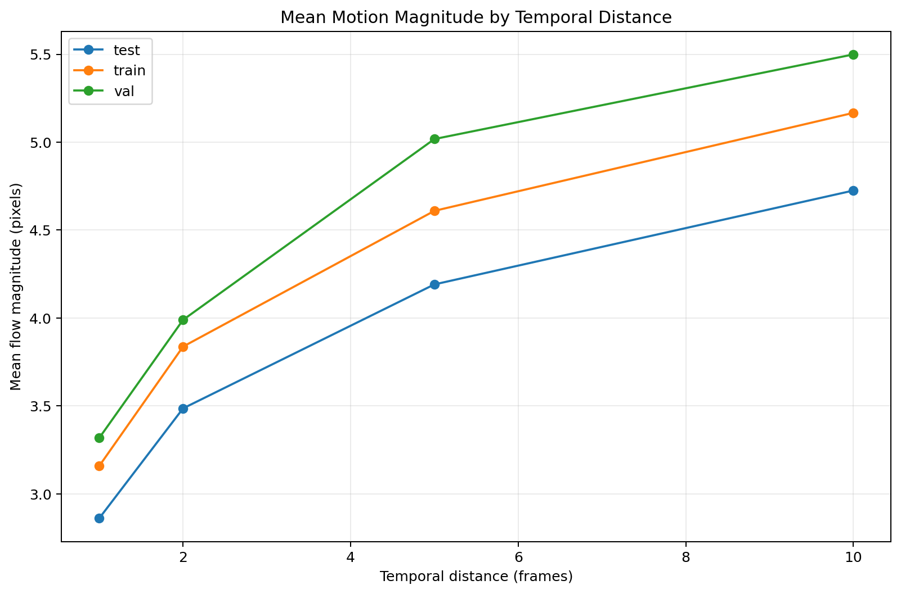
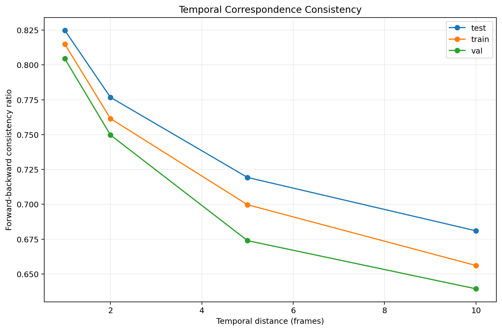
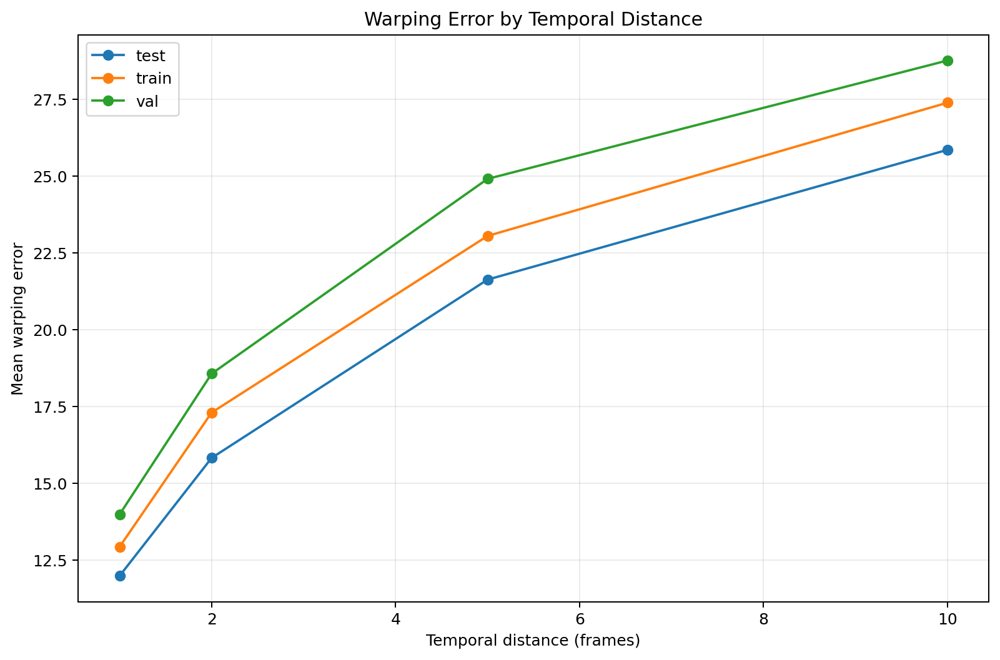
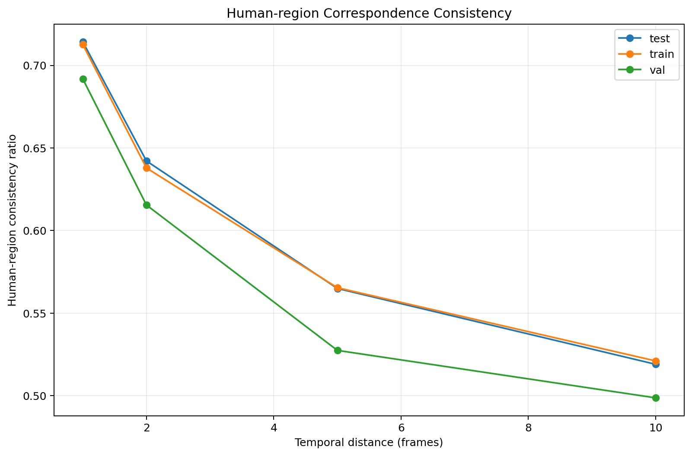
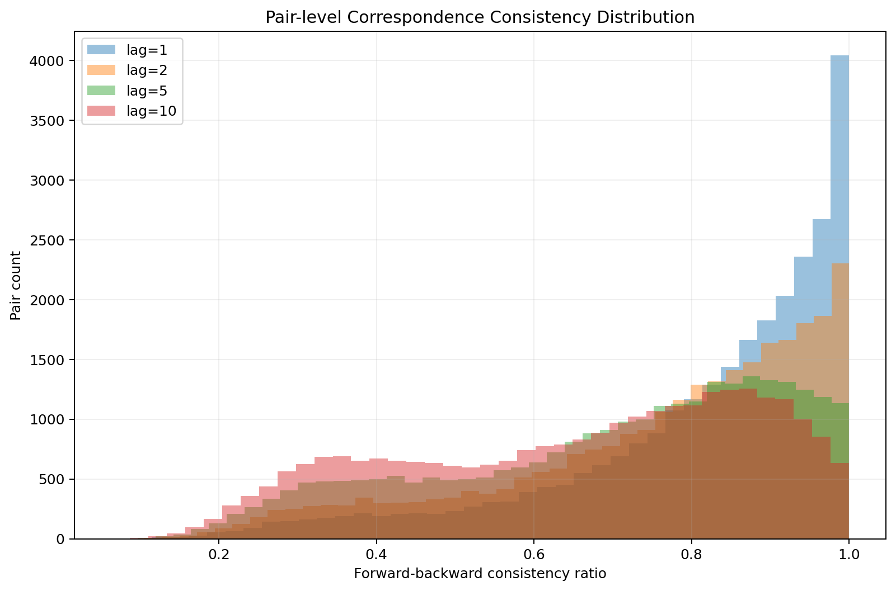
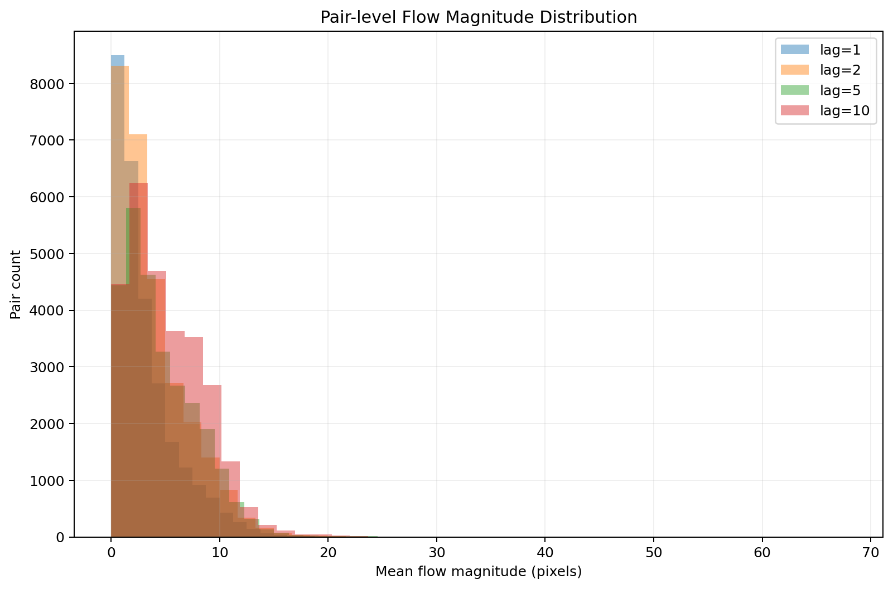
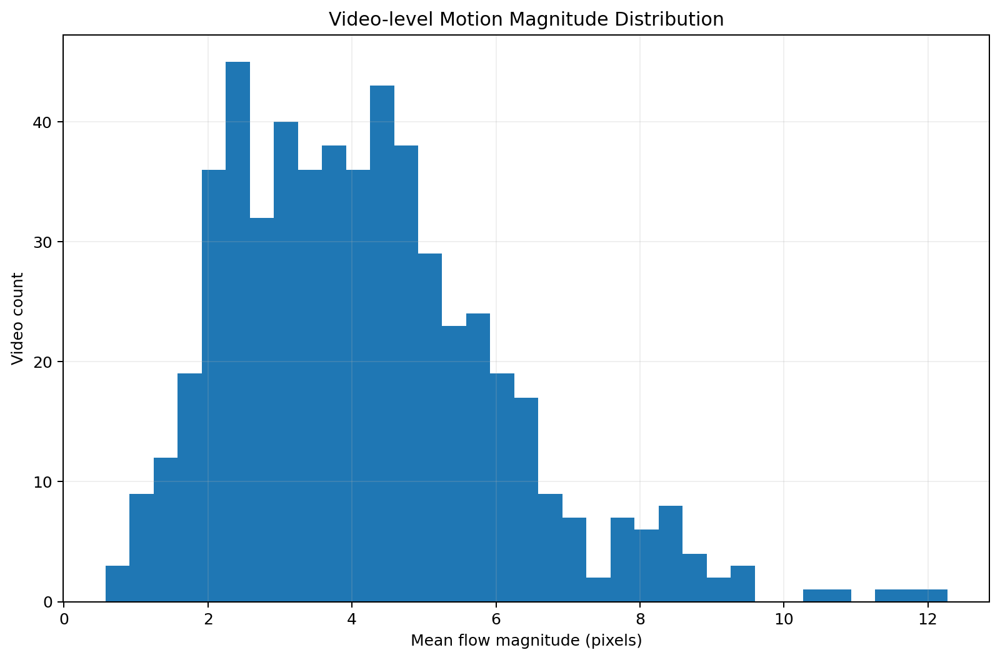

# Temporal Correspondence Analysis

## Overview

This directory contains the outputs of **Stage 05 — Temporal Correspondence Analysis** of the PhySense-Human / Human Video Correspondence pipeline.

The purpose of this stage is to quantify how reliably visual information can be spatially corresponded between frames belonging to the same video as the temporal distance between frames increases.

The analysis uses dense optical flow and evaluates temporal correspondence through several self-consistency measures:

* Dense optical-flow magnitude
* Forward-backward flow consistency
* Photometric warping error
* Human-region correspondence consistency

Because ground-truth motion vectors are not available in the dataset, these metrics should be interpreted as **optical-flow-based correspondence proxies**, rather than ground-truth correspondence accuracy.

---

## Analysis Configuration

The final analysis was performed using the following configuration:

| Parameter                   |                  Value |
| --------------------------- | ---------------------: |
| Temporal distances          |          `1, 2, 5, 10` |
| Image size                  |            `224 × 224` |
| Sampling mode               |            `per_video` |
| Maximum pairs / video / lag |                   `50` |
| Forward-backward threshold  |           `1.5` pixels |
| Dataset splits              | `train`, `val`, `test` |
| Random seed                 |                   `42` |
| Videos processed            |                  `552` |
| Candidate pairs             |              `110,291` |
| Successful pairs            |              `110,291` |
| Failed pairs                |                    `0` |

The complete execution took approximately **204.33 minutes**.

---

## Output Structure

The generated results are organized as follows:

* `correspondence/`

  * `correspondence_summary.csv`
  * `correspondence_summary.json`
  * `video_correspondence_statistics.csv`
  * `frame_pair_correspondence_statistics.csv`
  * `correspondence_errors.csv`
* `figure/`

  * `correspondence_consistency_distribution.png`
  * `correspondence_motion_by_temporal_distance.png`
  * `flow_magnitude_distribution.png`
  * `forward_backward_consistency.png`
  * `human_correspondence_consistency.png`
  * `video_motion_distribution.png`
  * `warping_error_by_temporal_distance.png`

---

# Figures

## 1. Motion Magnitude by Temporal Distance

This figure shows the average optical-flow magnitude as a function of temporal distance.

The results show a consistent increase in estimated motion magnitude as the temporal distance increases from 1 to 10 frames.

For example, in the training split:

| Temporal distance | Mean flow magnitude |
| ----------------: | ------------------: |
|                 1 |               3.159 |
|                 2 |               3.837 |
|                 5 |               4.609 |
|                10 |               5.167 |

This behavior indicates that frames become progressively more displaced in the image domain as their temporal separation increases.

---

## 2. Forward-Backward Correspondence Consistency

Forward-backward consistency evaluates whether optical flow estimated from the source frame to the target frame is compatible with flow estimated in the reverse direction.

The consistency ratio decreases systematically with temporal distance.

For the training split:

| Temporal distance | FB consistency |
| ----------------: | -------------: |
|                 1 |          0.815 |
|                 2 |          0.761 |
|                 5 |          0.700 |
|                10 |          0.656 |

The decrease indicates that correspondence becomes less self-consistent as the temporal gap increases.

---

## 3. Warping Error by Temporal Distance

Photometric warping error measures the difference between the target image and the source image warped according to the estimated optical flow.

The training split shows the following progression:

| Temporal distance | Mean warping error |
| ----------------: | -----------------: |
|                 1 |             12.938 |
|                 2 |             17.309 |
|                 5 |             23.059 |
|                10 |             27.398 |

The increasing error provides an additional indication that frame-to-frame correspondence becomes progressively more difficult over longer temporal intervals.

---

## 4. Human-Region Correspondence Consistency

This analysis restricts correspondence evaluation to the human region using the available full-human masks.

For the training split:

| Temporal distance | Human FB consistency |
| ----------------: | -------------------: |
|                 1 |                0.713 |
|                 2 |                0.638 |
|                 5 |                0.565 |
|                10 |                0.521 |

The human-region consistency follows the same general trend as the full-image correspondence analysis, with progressively lower consistency at larger temporal distances.

This is particularly relevant for human-video correspondence because it indicates that temporal correspondence degradation is also observable within the human regions rather than being exclusively caused by background motion.

---

## 5. Pair-Level Correspondence Consistency Distribution

This figure presents the distribution of pair-level forward-backward consistency across temporal distances.

The distribution illustrates the variability between individual frame pairs in addition to the mean behavior reported in the aggregate statistics.

The results demonstrate that correspondence quality is not uniform across all frame pairs. Some pairs remain highly consistent while others exhibit substantially lower correspondence consistency, particularly at larger temporal distances.

---

## 6. Pair-Level Flow Magnitude Distribution

This figure shows the distribution of optical-flow magnitudes across individual frame pairs.

The distributions shift toward larger motion magnitudes as temporal distance increases.

This complements the aggregate motion analysis by showing the variability of estimated motion across individual frame pairs rather than only reporting the mean.

---

## 7. Video-Level Motion Magnitude Distribution

This figure summarizes the distribution of mean motion magnitude at the video level.

The video-level aggregation helps characterize differences between videos and prevents the analysis from being interpreted solely as a collection of independent frame pairs.

---

# Quantitative Summary

Across all successful frame pairs, the global statistics were:

| Metric                      |         Mean |
| --------------------------- | -----------: |
| Flow magnitude              | 4.189 pixels |
| Forward-backward error      | 2.121 pixels |
| FB consistency ratio        |        0.733 |
| Mean warping error          |       20.203 |
| Human-region FB consistency |        0.607 |

The pair-level dataset contains **110,291 successful frame-pair comparisons** spanning the four temporal distances.

The observed trend is consistent across all three dataset splits:

**Increasing temporal distance → increasing estimated motion → increasing warping error → decreasing forward-backward consistency.**

---

# Split-Level Coverage

The analysis covered:

| Split      | Videos |         Pairs / lag |
| ---------- | -----: | ------------------: |
| Train      |    455 | approximately 22.9k |
| Validation |     51 |  approximately 2.6k |
| Test       |     41 |                2.1k |

Minor differences in pair counts across larger temporal distances are expected because not every video contains a valid frame pair separated by every requested temporal distance.

---

# Interpretation

The results provide evidence of a clear temporal degradation pattern in optical-flow-based visual correspondence.

At short temporal distances, frame pairs generally exhibit:

* Lower optical-flow displacement
* Higher forward-backward consistency
* Lower photometric warping error
* Higher human-region correspondence consistency

As temporal distance increases, the opposite pattern emerges:

* Motion magnitude increases
* Forward-backward consistency decreases
* Warping error increases
* Human-region consistency decreases

This provides a quantitative characterization of **temporal redundancy and temporal correspondence difficulty** within the dataset.

Importantly, these results should not be interpreted as direct measurements of ground-truth correspondence accuracy. The analysis relies on dense optical flow and self-consistency metrics because ground-truth motion vectors are not available.

---

# Reproducibility

The analysis was generated by:

`02_temporal_redundancy/05_temporal_correspondence.py`

The final configuration was:

* Lags: `1, 2, 5, 10`
* Image resolution: `224 × 224`
* Maximum sampled pairs per video and lag: `50`
* Sampling mode: `per_video`
* Forward-backward threshold: `1.5`
* Random seed: `42`

The resulting metadata is stored in:

`correspondence/correspondence_summary.json`

Detailed pair-level measurements are stored in:

`correspondence/frame_pair_correspondence_statistics.csv`

Video-level statistics are stored in:

`correspondence/video_correspondence_statistics.csv`

---

# Validation Status

The final execution completed successfully:

* **552 / 552 videos processed**
* **110,291 / 110,291 candidate pairs successful**
* **0 failed comparisons**
* **7 figures generated**
* Pair-level CSV generated
* Video-level statistics generated
* Aggregate summary generated
* JSON execution metadata generated

The empty `correspondence_errors.csv` is consistent with the reported `failed_pairs = 0`.

---

# Conclusion

Stage 05 successfully establishes a quantitative temporal correspondence profile for the dataset.

The results demonstrate a consistent relationship between temporal separation and correspondence difficulty across `train`, `val`, and `test` splits. In particular, larger temporal distances are associated with increased motion magnitude and warping error, together with reduced forward-backward and human-region correspondence consistency.

These results provide the empirical basis for subsequent analysis of temporal redundancy, frame selection, correspondence-aware sampling, or downstream human-video modeling.
